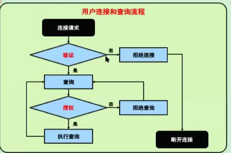
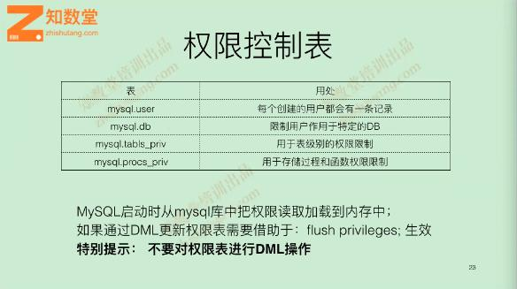

# 账户管理

在MySQL中可通过账户控制允许或不允许用户执行操作  
- 可以精细分配权限给不通职能的账户
- 避免使用root账户
	- 因公不能直接使用root
	- 防止维护期间出错
- 限制特定权限账户确保数据完整性
	- 允许特定授权账户完成期工作
	- 未经授权的用户访问超出其特权的数据
	

## 查询MySQL内的账户: 

	select  user,host ,authentication_string,plugin from mysql.user;

user()：当前连接的用户   
current\_user()：MySQL中注册的账户    
mysql5.7引入的加密方法：mysql\_native\_password   
mysql8.0默认的加密方法caching\_sha2\_password,导致升级8.0后之前程序默认无法连接，现在大多数验证使用：mysql\_native\_password  

### 5.7升级到8.0之后原来的程序连接数据库报错的解决办法
  
```
[mysqld]
default_authentication_plugin=mysql_native_password   
  
create user 'php'@'IP' identified with mysql_native_password by 'password';
  
```

## MySQL账号的组成

MySQL账户由两部分组成：用户名@ip来源  
如:  
root@192.168.1.100,root@172.16.1.100是属于不同的账户  
- 登录连接MySQL优先使用精确匹配的原则：root@192.168.1.100和root@%，MySQL优先连接root@192.168.1.100  
生产实践：当线上有大量的访问查询，使用的如果是非精确匹配的账户，我们可以创建精确匹配的账户的方式进行对其进行控制   
- MySQL连接数是进程还是线程，看编译方式，如果编译按照进程或者线程方式进行编译，那么MySQL连接进来就是其对应的连接的方式，按照官方二进制是进程的方式
用户连接和查询的流程如下图所示：  



### 创建用户:
范式：用户名@ip来源+密码  

	create user 'zst'@'192.168.0.0/255.255.255.0' identified by '123456';
	create user 'zst'@'192.168.0.%' identified by '123456';
- 风险提示
	- 不创建无用户名的账户
	- 不创建没有密码的账户
	- 在可能的情况下，不要使用主机通配符
- 修改用户名称其它不变  
	- rename user 'user'@'localhost' to 'user1@'localhost';
	zst'@'192.168.0.0/255.255.255.0可以使用zst'@'192.168.0.%
	- %所有字符
	- -单个字符
	
### 删除用户
**`drop user 'user'@'localhost';`**
- 5.7之前初始化数据库后需要进行安全加固  
```sql
delete from mysql.user where user='test' or host='localhost';
truncate table mysql.db;
flush privileges;
```
	
### 修改密码:			
	alter user 'user'@'localhost' identified by '123456';
	
#### 设置密码过期  
	alter user 'user'@'localhost' password expire';  
#### 锁定用户  
	alter user 'user'@'localhost' account lock/unlock;  
#### 忘记密码怎么解决   
	mysqld --defaults-file=/data/mysql/mysql3306/my.cnf --skip-grant-tables --skip-networking  & ;  
	update mysql.user set authentication_string=password('new_passwd') where 'user'@'localhost' where user='root' and host='localhost';
	update mysql.user set authentication_string='' where 'user'@'localhost' where user='root' and host='localhost';8.0中无法使用password函数，先把密码设置为空，然后在改成相应的密码
#### 黑科技破解密码 
 拷贝mysql/user.*中的表，进行相应的修改，kill -HUP pid重读配置文件即可(仅限5.x系列)
 
#### MySQL8.0.14以后版本修改密码新特性

mysql8.0.14版本以后支持同一个账户2个密码登录

	alter user 'user_name'@'host' identified by 'new_password' retain current password; 设置另外一个密码
	allter user 'user_name'@'host' discard old password;使老密码失效

特别提示：想使用这个特性的用户需要具备MySQL8.0后的新权限：APPLICATION\_PASSWORD\_ADMIN。另外要注意以下几点：   
retain current password是声明当前的第二个密码，多次声明，最后一个生效。用户可以同时用原来密码和声明的新密码登录   
retain current password语句中不能指定空密码   
在指定了retain current password后 ，又使用alter user更改原来的主密码，利用retain current password声明的第二密码不会变更  
如果在使用retain current password后，又更改认正模式，声明的第二密码失效   
如果没有使用retain current passwod,使用alter user .. discard old password ；不会把原来的密码删掉   

### MySQL连接错误

```
MySQL账户或者密码错误都会有相应记录，在performance_schema.host_cache表中
COUNT_AUTHENTICATION_ERRORS字段表示连接错误的次数
需要将skip_name_resolve参数关闭，并调整host_cache_size不为0

连接延迟配置
max_connect_errors连接错误次数，如果超个这个值就会出现
Host is blocked because of many connection errors; unblock with 'mysqladmin flush-hosts'
加载插件
INSTALL PLUGIN CONNECTION_CONTROL SONAME 'connection_control.so';
INSTALL PLUGIN CONNECTION_CONTROL_FAILED_LOGIN_ATTEMPTS SONAME 'connection_control.so';
参数解释
connection_control_failed_connections_threshold：在服务器为后续连接尝试添加延迟之前允许客户端连续失败的连接尝试次数。
connection_control_min_connection_delay：每次连续失败超过阈值时添加的延迟量。
connection_control_max_connection_delay：添加的最大延迟
```
[更多信息参看官方文档](https://dev.mysql.com/doc/refman/8.0/en/connection-control-installation.html)

## 权限管理

合理的控制权限是DBA一个重要职责，以下MySQL中可以对其精确授权
- 全局
- 数据库
- 表
- 列
- 存储过程

### grant授权

  

	grant 权限 on dbname.table_name to 'user'@'localhost'; 
	flush privileges;

- 权限可以查询show privileges；检查则使用show grants for 'user'@'localhost';
- \*.\*表示所有库所有表
- 授权如果加上grant all ...... with grant option表示授权超级管理员，可以给其它任何用户授权和回收权限

### revoke回收

**`revoke 权限 on *.* from 'user'@'localhost';`**   

- 权限可以查询show privileges;
- \*.\*表示所有库所有表  
[权限解释](https://blog.csdn.net/anzhen0429/article/details/78296814)


  