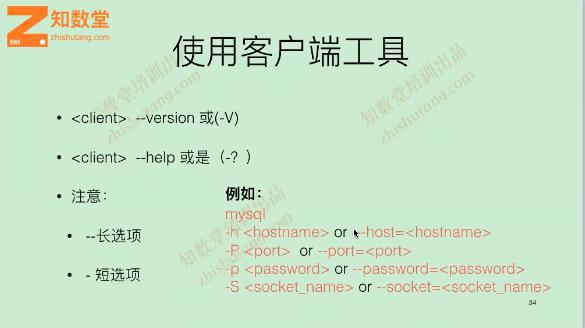
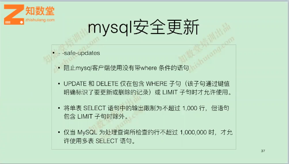
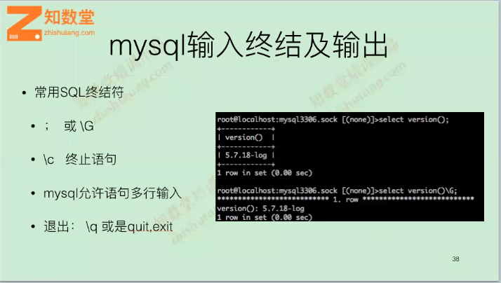
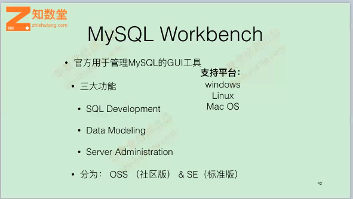

# MySQL客户端

## mysql客户端程序

- mysql：将mysql语句发送到服务端
- mysqladmin：用于管理mysql服务端，与shell进行交互
- mysqldump：数据库备份工具，替代品mydumper
- mysqlbinlog：解析binlog日志重要工具

### mysql客户端工具选项
  

### mysql客户端登录方式

1. mysql -u[user_name] -p[password] -h[hostname]  
此方法常用语远程登录

2. mysql -S /tmp/mysql3306.sock -p[password]  
此方法用于本地登录socket方式，没有指定用户使用当前的用户，前提是mysql中账户需要有此用户    
mysql --defaults-file=[file] -S /tmp/mysql3306.sock -p[password]指定客户端配置文件

3. mysql --login-path=[label]  
```
设置
mysql_config_editor set --login-path=3307 --host=localhost --socket=/tmp/mysql3307.sock --user=root --port=3306/3307 --password
查询在~/.mylogin.cnf
mysql_config_editor print --all
[3306]
user = root
password = *****
host = localhost
port = 3306
socket = /tmp/mysql3306.sock
[3307]
user = root
password = *****
port = 3307
host = localhost

socket = /tmp/mysql3307.sock
如果是远程主机无需socket，--login-path=nane只是个标识名称而已
登录
mysql --login-path=3306
```

### mysql安全更新

 


### mysql输入终结及输出

 

### 客户端GUI工具

wokebench是MySQL官方的GUI免费工具，当然其它的类似的工具很多，可以自行选择

 