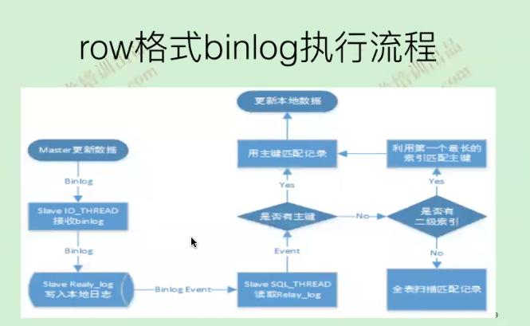
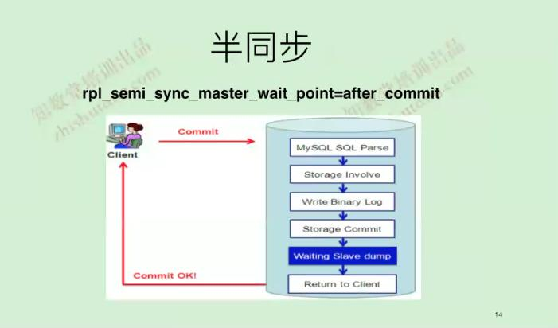
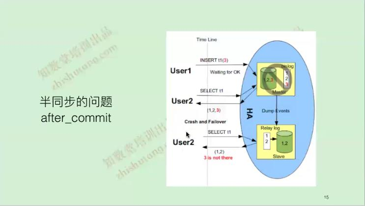
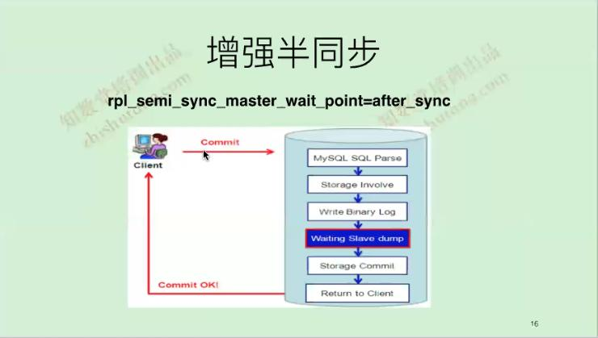
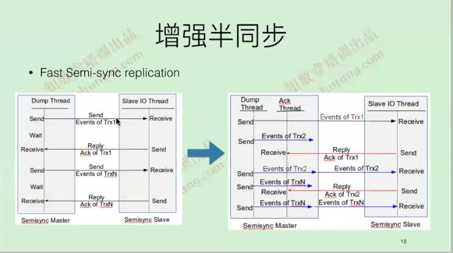
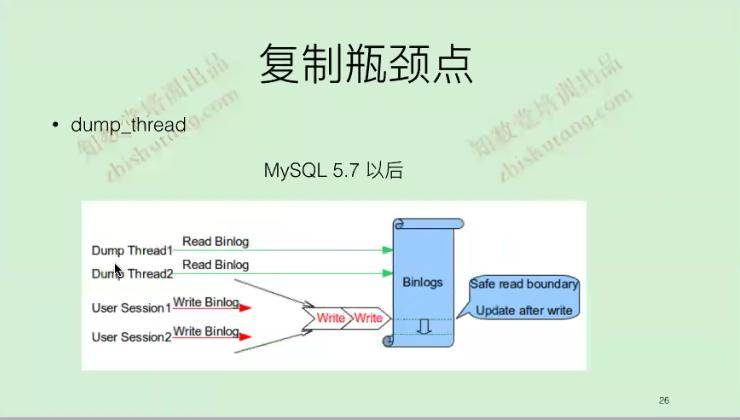
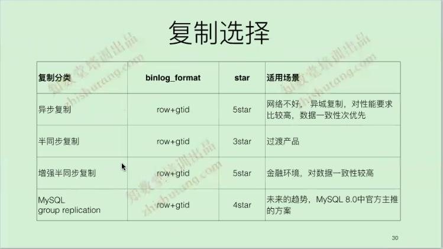

# 理解binlog

- 根据日志定义的格式不一样可以分成：statement(SBR)，Row(RBR)或者MTXED格式
- 记录最新单位是一个Event，日志前4个字节是一个magic number(0xbin)，接下来19个字节记录Format desc event：FDE
- 一个事物由多个event组成如：
	- BEGIN
	- Table_map
	- Write_rows
	- Xid
	- COMMIT
- binlog包含：binary log和binary log index文件

# 复制中记录binlog格式

MySQL中使用row格式进行复制，原因如下：
- statement格式复制的优缺点
	- 优点：
		- 基于语句级别的复制binlog_format=statement
		- binlog文件较小
		- binlog方便阅读，方便故障修复
	- ***缺点***：
		- ***存在安全隐患，可能导致主从不一致的***
		- ***对一些系统函数不能准确复制或者不能复制，MySQL5.1抛弃了statement格式***
			- load_file()
			- uuid()
			- user()
			- sysdate() 
			
- row格式复制的优缺点：
	- 优点：
		- 相比statement格式更加安全binlog_format=row
		- 在某些情况下复制速度更快(sql复杂，表有主键)、
		- 系统的特殊函数也能够复制
		- 更少的锁
	- 缺点：
		- binary log比较大
		- 单语句更新(删除)表的行数量过多，会形成大量的binlog
		- 无法从bin_log看见用户执行的sql(binlog_row_query_log_events记录用户的query)

- mixed格式：
	- 此种格式属于一个过渡的格式
	- MySQL很多版本的新特性都是针对row+gtid，所以不要使用这种格式，没有太多的价值
	
# row格式binlog执行流程
  
master把更新内容写到binlog里面-->  
dump_thread唤醒IO_thread告诉我有更新了-->  
IO_thread把日志拉取到本地放到relay(供SQL_thread进行重放)日志中-->  
SQl_thread读取relay日志会查看语句有没有主键-->用主键匹配记录更新数据库  
没有主键查是否有二级索引-->利用第一个最长(字符类型的字节数)的索引匹配(内部隐藏  的rowid)
5.6每次全表扫描，5.7做了优化(第一次做全表扫描生成hash索引，以后走hash索引进行更新，重启丢失；所以每个必须需要主键，此种情况这个从库基本不可用，各种延迟(解决办法：从库停掉，在从库上添加索引，方可解决)  

set sql_log_bin=1;关闭二进制日志功能，从库上新增相应的索引；然后在合适的时候在主库上新增相应的索引，最后启动二进制日志功能
# GTID用于解决什么问题

GTID：为每个写的动作做一个唯一的编号  
- 主机和从库上分别产生了多少个写事务 
- 这个事务是谁产生的

# 半同步

MySQL5.5和5.6中使用的机制  
- SQL处理
- 引擎层处理
- 写入binlog
- 引擎层提交(此时不给客户端返回)
- 保证日志传到slave上
- 再给客户端返回    
    

**出现问题**：同一个时刻在主从读取的数据不一样([数据不一致性读](https://blog.csdn.net/qq_34569497/article/details/79064208))，官方为了解决这个问题，推出了增强半同步  

# 增强半同步

最早由淘宝周振兴提出  
增强半同步特性  
- 技术上去掉了幻读
- 同时在MySQL5.7.4后引入了Fast Semi-sync Replication
- 但增强半同步依然存在数据不一致的情况   

处理过程
- SQL处理
- 引擎层处理
- 写入binlog
- 保证日志传到slave上
- 引擎层提交
- 再给客户端返回

[参考资料1](https://juejin.im/entry/5c061adf6fb9a049c23232d6)  
[参考资料2](http://blog.itpub.net/30109892/viewspace-2062493/)  

Innodb在有Binlog时写入流程： 
1. 事务先写引擎(如：undo和redo)
2. 事务在redo commit(由于事务在提交的时候是串行的)需要拿到mutex_prepare_lock，并在redo log中写入Xid
3. 写binlog，等待binlog写入成功commit带上Xid
4. redo中写入binlog filename position，释放mutex_prepare_lock

Mysql Crash Recovery机制：
1. mysql起来扫描redo，看处于prepare状态的Xid
2. 拿到Xid去扫描最后一个binlog看Xid是否存在；存在，则该事务已经写完binlog，只不过还没有来得及写binlog filename position到redo，直接commit；否则就没有写完binlog就回滚    

   

**增强半同步数据不一致的地方**   
- **表现在多一个事务多一条数据**   
- 主从同步没有解决此问题
- MGR处理的方法：没有复制过去的Binlog Event给truncate掉(跟客户端没有相应的事务，叫做不完整的事务，删除是没有任何问题)，MGR先查询自己传递过去的GTID，然后再去查询本地GTID，对比一下本地是否比远程的多，如果多就把本地多余的GTID给truncate掉，保证本地和远程是一致的  

总结不管是半同步还是增强半同步都会有多一个事务(一条数据)的差别，出现这样情况属于特别高并发场景的极端情况，99.9%不会出现。

# 半同步会不会有延迟

- 会有延迟
	- 半同步只是IO_thread和主库保持同步，sql_thread无要求

# 复制的瓶颈点

- dump thread
- IO_thread
- SQL_thread
	- 基于database级别并行(mysql 5.6)
	- 基于事务级别并行(mysql 5.7)
		- binlog group commit
	- 基于行级别并行(writeset实现MySQL8.0)

只是保证主库上提交的事务一定会被传输到从库的relay_log，但是SQL_thread有没有应用完没有办法保证，所以会存在延迟  
mysql5.7已经对其优化了很多，性能是5.6的两到三倍，所以5.7是5系列中最好的  

 

 

 

# 复制选择

 

[其它参考](https://www.jianshu.com/p/c46cf46beff7)

