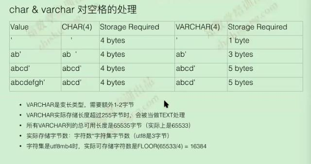

# MySQL数据类型

### 整形

以下内容是MySQL dba专家多年总结的经验，
在MySQL整形中只需要记住选择INT和BIGINT即可，其它整形可以忽略，因为他们存在的价值都没有那么大了
- 范围、长度

|	Type	|	Storage	|	Min(Signed/Unsigned) 	|	Max(Signed/Unsigned)	|
|:---------:|:---------:|:-------------------------:|:-------------------------:|
|  INT  	|	4		|	-2147483648   			|	2147483648    			|
|  	    	|	4		|	0   					|	4294967296   			|
|BIGINT 	|	8		|	-9223372036854775808   	|	9223372036854775808    	|
|BIGINT 	|	8		|	0					   	|	18446744073709551616    |

- INT(11)
	1. 11是显示的宽度，不是长度的限制
	2. 如果加上zerofill，INT(11)存储1024，则显示为00000001024

- 注意事项：
	1. int类型在正常自增的情况下不会写满，如有一下场景就会出现int类型写满的情况，因为单表十几亿情况下本身就是瓶颈点
没有分表，没有使用全局序列，自增步长设置比较大的情况下，int类型足够使用
	2. 生产场景：扣款等交易所有的强烈建议所有请求都走一个主库，任何时间只能一个点进行写入，防止出问题，这是一个很大的风险点(原因是因为如果主从存在数据延迟的情况) 
	3. 扣款需要检查余额是否能够成功扣款，是否有溢出，防止出现负数采用Unsigned无符号的整形
	4. 同一个字段在其它表中要注意字段类型必须一致，会发生转换成string类型进行比较，导致结果出错

 

### 浮点型  

- **互联网的世界基本不需要浮点数**  
因为浮点数永远不是一个精确的值  
建议把金额转换为分按INT来存储  
decimal类型建议也不要使用，如果是单纯存入还可以，如果涉及到运算不建议使用

### 日期类型
5.7以后建议都用datetime(3)，如果5.7之前用timestamp(6)
|	Type	|	bytes	|	fractional seconds storage 	|
|:---------:|:---------:|:-------------------------:|
|DATATIME 	|	8		|	5bytes + fractional seconds storage   	|	
|TIMESTAMP 	|	4		|	4bytes + fractional seconds storage		|

|	Fractional Seconds	|	Storage	Required    |
|:---------:|:---------:|:-------------------------:|
|0 		|	0byte		|	
|1，2 	|	1byte		|	
|3，4 	|	2byte		|	
|5，6 	|	3byte		|	

### 字符类型

字符类型都有字符集的概念
首先我们需要放弃char类型了  
原因  
- InnoDB引擎对char类型没有任何的友好的支持
- char范围是255字节之间；varchar范围65535个字节
- char是MyISAM引擎的产物
- char(32)与varchar(32)同时存abc字符，一个占96个字节，一个占10字节
- MyISAM引擎使用当然char效率高速度快，InnoDB引擎使用varchar比char好  

### json类型

5.7中出现，不可用属于大坑，8.0里面增强，仍旧有问题

# 字段类型规范
InnoDB表是索引聚集组织表(IOT)，所有的行数据(row data)都是以主键(严格意义讲，是聚集索引)逻辑顺序存储，而二级索引(或称辅助索引，secondary index)的value则同时包含主键,如果主键是随机排序将导致插入的数据性能越来越慢，所以每个表需要有主键，而且主键是从小到大顺序增长。
InnoDB的最小I/O单位是data page(默认一个data page大小是16KB)，在buffer pool中的最小单位是data page(而不是每行数据)，因此也可以这么理解，一个data page里面的热点数据越多，其在buffer pool的命中率就会越高  
MySQL复制环境中，如果binlog format是row的，则从库上的数据更新时是以主键为依据进行apply的，如果没有主键则将可能会有灾难性的后果  
强烈建议每张表三个必须加的字段aid(int/bigint unsigned类型，自增长列，并且作为主键)，create_time(datetime或int unsigned)

### 字段设计参考

1. 每个表建议不超过30-50个字段
2. 优先选择utf8字符集，需要存储emoji字符的，则选择utf8mb4字符集
3. 严禁在数据库中明文存储用户密码，身份证，信用卡号，等核心机密数据，务必先行机密
4. 存储整形数据时，默认加上unsigned扩大存储范围
5. 建议用INT UNSIGNED存储IPV4地址，查询时再利用INET_ATON()，INET_NTOA()函数转换
6. 如果遇到blob，text字段，则尽量拆出去，再利用主键做关联
7. 在够用的前提下，选择尽可能小的字段，用于节省磁盘和内存空间
8. 涉及精确金额香港用途时，建议扩大N倍后，全部转换成整理存储，避免浮点数加减出现不准确的问题

### 常用数据类型参考

1. 字符类型建议采用varchar数据类型(InnoDB建议用Varchar替代Char)
2. 金额货币科学计数建议采用decimal数据类型，如果运算在数据库中完成可以使用bingint存储，单位：分
3. 自增长度标识建议采用int或bigint数据类型，如果该表有大量的删除及再写入就用bigint，反之int就够用  
4. 时间类型建议采用datetime数据类型
5. 禁止使用text，logtext等数据类型
6. 字段值如果是非负数，必须是unsigned
