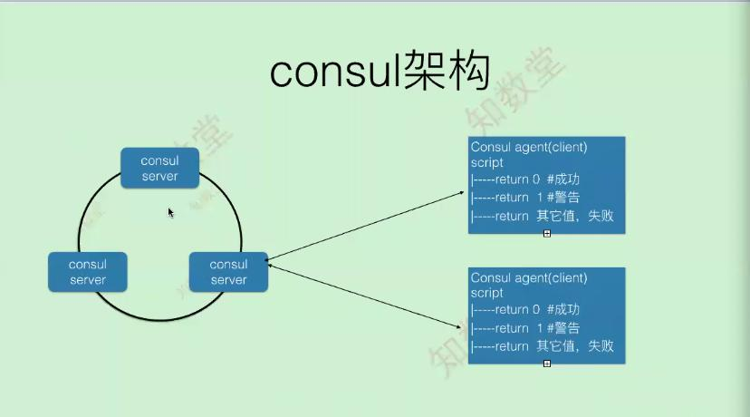

#私有云

[相关资料参考1](http://blog.didispace.com/consul-service-discovery-exp/)   
[相关资料参考2](http://www.fblinux.com/?p=1127)

  

## consul server部署
```
1. 容器创建5台consul服务
docker run -d -v /application:/application  -v /etc/hosts:/etc/hosts -v /etc/resolv.conf:/etc/resolv.conf -p8500:8500 -p53:53   --net zstnet --ip 172.18.0.6 --cap-add=SYS_PTRACE --cap-add=NET_ADMIN  --privileged=true --name consul01  -h consul01 zst14/centos7:latest

2. 创建相关目录
   mkdir /etc/consul.d/      配置文件存放目录
   mkdir /data/consul/script 健康检查脚本存放目录

3. 服务配置文件server.json
{
	"data_dir":"/data/consul",
	"datacenter":"dc1",
	"log_level":"INFO",
	"server":true,
	"bootstrap_expect":3,		#带有此标识的需要第一个起来，表示集群至少3台存活才对我提供服务
	"bind_addr":"172.18.0.6",
	"client_addr":"172.18.0.6", #可以改成0.0.0.0，否则在所有命令后面需要指定--http-addr=172.18.0.6
	"ports":{
		"dns":53
	},
	"ui":true,
	"retry_join":["172.18.0.7","172.18.0.8","172.18.0.9","172.18.0.10"],
	"retry_interval":"3s",
	"raft_protocol":3,
	"rejoin_after_leave":true
	
}

4. 启动consul
consul agent --config-dir=/etc/consul.d/ > /data/consul/consul.log 2>&1 &
consul members 
consul leave
consul info

```

## consul client部署



```
1. 创建agent客户端配置文件/etc/consul/client.json和/etc/consul/proxysql.json
{
	"data_dir":"/data/consul",
	"enable_script_checks":true,
	"bind_addr":"172.18.0.5",
	"retry_join":["172.18.0.6","172.18.0.7","172.18.0.8","172.18.0.9","172.18.0.10"],
	"retry_interval":"30s",
	"rejoin_after_leave":true,
	"start_join":["172.18.0.6","172.18.0.7","172.18.0.8","172.18.0.9","172.18.0.10"]
}


{
	"service":
		{
			"name":"proxysql",      #consul默认的域名为service.consul，所以此对外访问域名为proxysql.service.consul
			"tags":[ "proxysql-172.18.0.5" ],
			"address":"172.18.0.5",
			"port":6033,
			"check":
					{
						"args":[
								"/data/consul/script/proxysql.sh"
								
								],
						"interval":"10s"
					}
	
		}
	
	
}

2. 服务注册检查脚本/data/consul/script/proxysql.sh

#!/bin/bash
#

check_proxysql(){
        if /usr/local/mysql/bin/mysql -uproxysql  -p123456   -P6033  -h172.18.0.5 -e 'select @@server_id for update;' &> /dev/null;then
                echo "172.18.0.5-proxysql is OK"        
                return 0

        else
                echo "172.18.0.5-proxysql is fail"      
                return 2
        fi

}


3. 测试访问在176.18.0.4上面
在176.18.0.4主机上nameserver 176.18.0.6/7/8/9/10 dns指向consul server  
dig proxysql.service.consul 
proxysql.service.consul. 0	IN	A	172.18.0.5解析记录

/usr/local/mysql/bin/mysql -uproxysql -p123456 -hproxysql.service.consul -P6033可以正常登陆和访问proxysql
```

##replication manager

```
yum install mercurial    -y
https://studygolang.com/dl  go包的下载地址，可以选择最新的版本
wget https://studygolang.com/dl/golang/go1.12.4.linux-amd64.tar.gz
tar xf go1.12.4.linux-amd64.tar.gz
ln -s /application/go  /usr/local/go

建立Go语言的工作空间（workspace，也就是GOPATH环境变量指向的目录）
Go语言代码必须在工作空间内。工作空间是一个目录，其中包含三个子目录：
src ---- 里面每一个子目录，就是一个包。包内是Go语言的源码文件
pkg ---- 编译后生成的，包的目标文件
bin ---- 生成的可执行文件
这里，我们在/home目录下，建立一个名为go（可以不是go, 任意名字都可以）的文件夹，然后再建立三个子文件夹（子文件夹名必须为src、pkg、bin
mkdir /home/go/{scr,pkg,bin} -p

添加环境变量
vim /etc/profile.d/go.sh
export GOROOT=/usr/local/go
export PATH=$GOROOT/bin:$PATH
export GOPATH=/data/rgm ##go项目目录，接下来replication manager目录就是此目录

mkdir /data/rgm/src/github.com/signal18/
cd /data/rgm/src/github.com/signal18/
git clone  https://github.com/signal18/replication-manager.git
./build_linux_amd64.sh
./package_linux_amd64.sh
cd /data/rgm/src/github.com/signal18/replication-manager/build/release
rpm -ivh replication-manager-osc-2.0.1_25_g5d20-1.x86_64.rpm 

配置文件
vim /etc/replication-manager/config.toml
[db3306]
title = "db3306"
db-servers-hosts = "172.18.0.11:3306,172.18.0.12:3306,172.18.0.13:3306"
db-servers-prefered-master = "172.18.0.11:3306"
db-servers-credential = "proxysql:123456"
replication-credential = "repl:123456"
failover-mode = "manual"
proxysql=true
proxysql-server="172.18.0.5"
proxysql-port=6033
proxysql-admin-port=6032
proxysql-writer-hostgroup=10
proxysql-reader-hostgroup=100
proxysql-user="test"
proxysql-password="test"
proxysql-bootstrap=false
[Default]
monitoring-datadir = "/data/replication-manager"
monitoring-sharedir = "/data/share_replication-manager"
log-level=7
log-file = "/var/log/replication-manager.log"
replication-multi-master = false
replication-multi-tier-slave = false
failover-readonly-state = true
http-server = true
http-bind-address = "0.0.0.0"
http-port = "10010"


启动/usr/bin/replication-manager-osc monitor  > /dev/null 2>&1 &
web界面访问：ip:10010

```

[yum安装参考](https://www.cnblogs.com/2woods/p/9575621.html)
